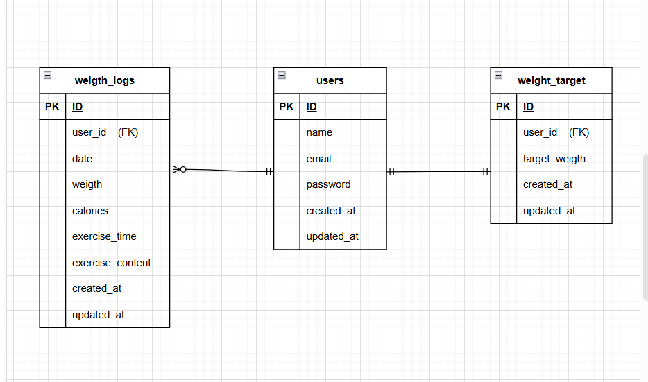

# 環境構築
## Dockerビルド
1. $ git clone git@github.com:Estra-Coachtech/laravel-docker-template.git
2. docker-compose up -d --build

## Laravel環境構築
1. docker-compose exec php bash
2. compose install
3. cp env.example .envまたは、新しく.envファイルを作成。

　.envに以下の環境変数を追加。
```
DB_CONNECTION=mysql
DB_HOST=mysql
DB_PORT=3306
DB_DATABASE=laravel_db
DB_USERNAME=laravel_user
DB_PASSWORD=laravel_pass
```

5. アプリケーションキーの作成

    `
    php artisan key:generate
    `
6. マイグレーションの実行

   `
   php artisan migrate
   `
7. シーディングの実行
   
   `
   php artisan db:seed
   `

## URL
- お問い合わせ画面　http://localhost
- 会員登録　http://localhost/register/step1
- phpMyAdmin http://localhost:8080/

## 使用技術（実行環境）
- PHP 8.1.33
- Laravel  8.83.8
- My SQL 11.8.3

## ER図

